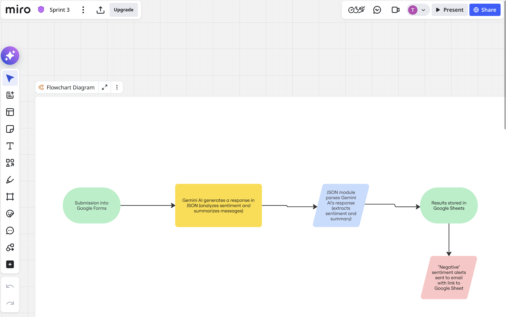
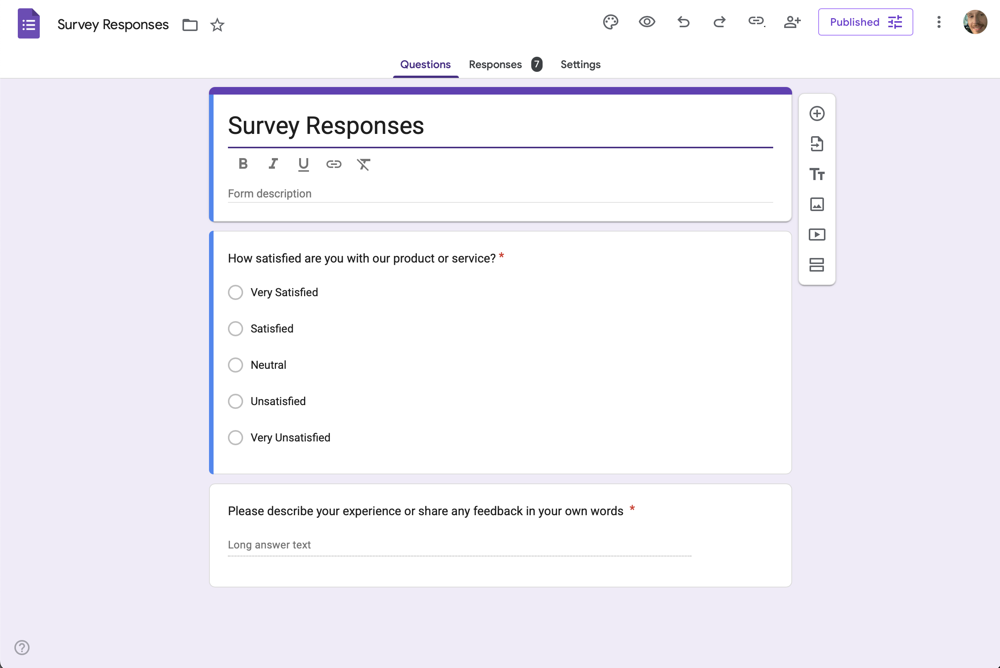
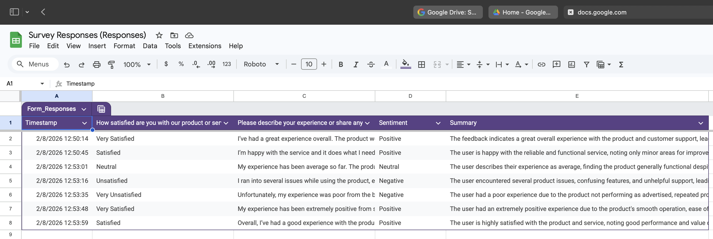
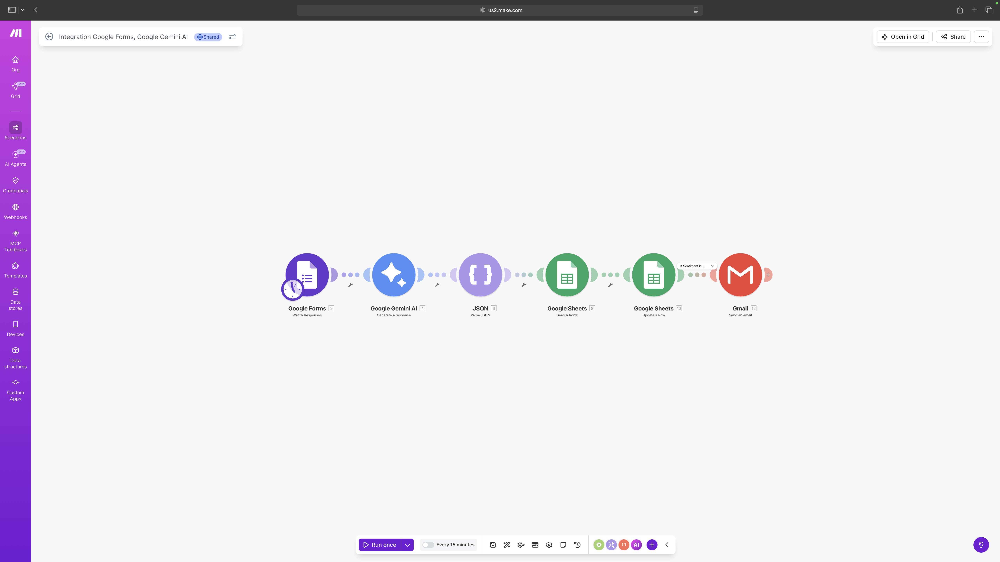

# AI-Powered Customer Feedback Analysis System

## Overview

This project is an automated workflow that collects customer feedback, analyzes it using AI, and converts it into structured, actionable insights.

This project simulates a real-world customer success workflow where feedback is continuously monitored, analyzed, and acted upon using AI-driven automation.

The system helps businesses quickly understand customer sentiment, identify issues, and respond to negative feedback in real time.

---

## Problem

Customer feedback is often unstructured and difficult to analyze at scale. Manually reviewing responses is time-consuming and can lead to missed insights or delayed responses to negative experiences.

---

## Solution

This system automates the entire feedback loop:

1. Collect feedback via Google Forms  
2. Send responses to Gemini AI for sentiment analysis and summarization  
3. Parse structured output (JSON format)  
4. Store results in Google Sheets  
5. Trigger alerts for negative feedback  

---

## Tools Used

- Google Forms (data collection)
- Make (automation workflow)
- Gemini AI (sentiment analysis + summarization)
- Google Sheets (data storage)

---

## Workflow Breakdown

1. User submits feedback via Google Form  
2. Make detects new submission (trigger)  
3. Feedback is sent to Gemini AI  
4. AI returns structured output:
   - Sentiment (Positive / Neutral / Negative)
   - Summary (1–2 sentences)  
5. JSON parser extracts values  
6. Data is stored in Google Sheets  
7. Email alert is triggered for negative sentiment  


---

## Example Output

```json
{
  "sentiment": "Negative",
  "summary": "User experienced delays and was dissatisfied with customer support response time."
}
```

---

## Outcome

- Reduces manual effort required to review customer feedback  
- Automatically classifies sentiment for faster decision-making  
- Transforms unstructured feedback into structured, usable data  
- Enables quicker response to negative customer experiences  
- Creates a scalable system for ongoing feedback analysis  

---

## Future Improvements

- Add dashboard for visualization (e.g., Looker Studio)  
- Implement priority scoring for urgent issues  
- Integrate with CRM systems  
- Expand classification beyond sentiment (e.g., categories, urgency)  
- Track trends over time for better decision-making  

---

## Project Status

Completed as a functional automation system with real-world application for analyzing and acting on customer feedback.

---

## System Visualization

This diagram outlines the end-to-end system design before implementation.

### Workflow Design (Miro)


### Google Form (Input Collection)


### Google Sheets (Structured Output)


### Make Scenario (Automation Workflow)


---
