# CUSTOMER FEEDBACK AI ANALYSIS SYSTEM

An AI-powered automation workflow that analyzes customer feedback submissions, detects sentiment, summarizes responses, and generates automated alerts for negative customer experiences.

This project demonstrates how AI automation can transform unstructured customer feedback into organized business insights that improve response visibility, operational awareness, and customer experience management.

---

## Overview

Businesses that collect customer feedback often struggle to manually review submissions, identify negative experiences quickly, and organize customer insights efficiently. As submission volume increases, manual review becomes time-consuming and inconsistent.

This automation system streamlines the feedback analysis process by capturing customer submissions, analyzing sentiment with Gemini AI, parsing structured response data, updating operational records, and sending automated alerts when negative feedback is detected.

The workflow reduces manual review effort while improving visibility into customer sentiment and operational response speed.

---

## Business Problem

Businesses that rely on customer feedback often face operational challenges when trying to monitor customer satisfaction manually.

This creates several issues:

- Slow identification of negative customer experiences
- Manual review of feedback submissions
- Inconsistent sentiment analysis
- Difficulty organizing customer insights
- Delayed escalation of customer concerns
- Time-consuming feedback management processes

A scalable automated solution was needed to analyze customer feedback, structure operational insights, and trigger alerts automatically.

---

## Solution

Built an automated workflow that:

- Captures customer feedback submissions through Google Forms
- Sends feedback responses to Gemini AI for sentiment analysis
- Generates AI-powered customer feedback summaries
- Parses structured JSON response data
- Searches and updates matching Google Sheets records
- Detects negative customer sentiment automatically
- Sends manager alert emails for negative feedback submissions
- Reduces manual feedback review effort

---

## Workflow Breakdown

1. Customers submit feedback through a Google Form

2. Make detects new customer feedback submissions automatically

3. Gemini AI analyzes the customer response for sentiment and summary generation

4. JSON parsing extracts structured AI response data

5. Google Sheets searches for the matching customer feedback row

6. Google Sheets updates the row with sentiment and AI-generated summary fields

7. A sentiment filter checks whether the feedback is negative

8. Gmail sends an automated manager alert email for negative customer feedback

---

## Value Added

- Automates customer feedback analysis workflows
- Improves visibility into customer sentiment trends
- Reduces manual feedback review processes
- Accelerates escalation of negative customer experiences
- Organizes customer insights into structured operational records
- Demonstrates practical AI-powered workflow automation

---

## Tech Stack

- Make (Integromat)
- Google Forms
- Google Sheets
- Gemini AI
- Gmail
- JSON Parsing
- Prompt Engineering
- Workflow Automation
- Sentiment Analysis Automation
- No-Code Automation

---

## Workflow Screenshots

### Workflow Architecture Diagram

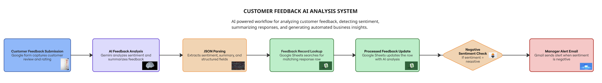

---

### Make Workflow Overview

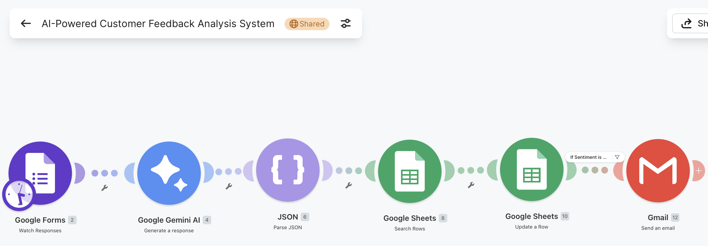

---

### Customer Feedback Submission Form

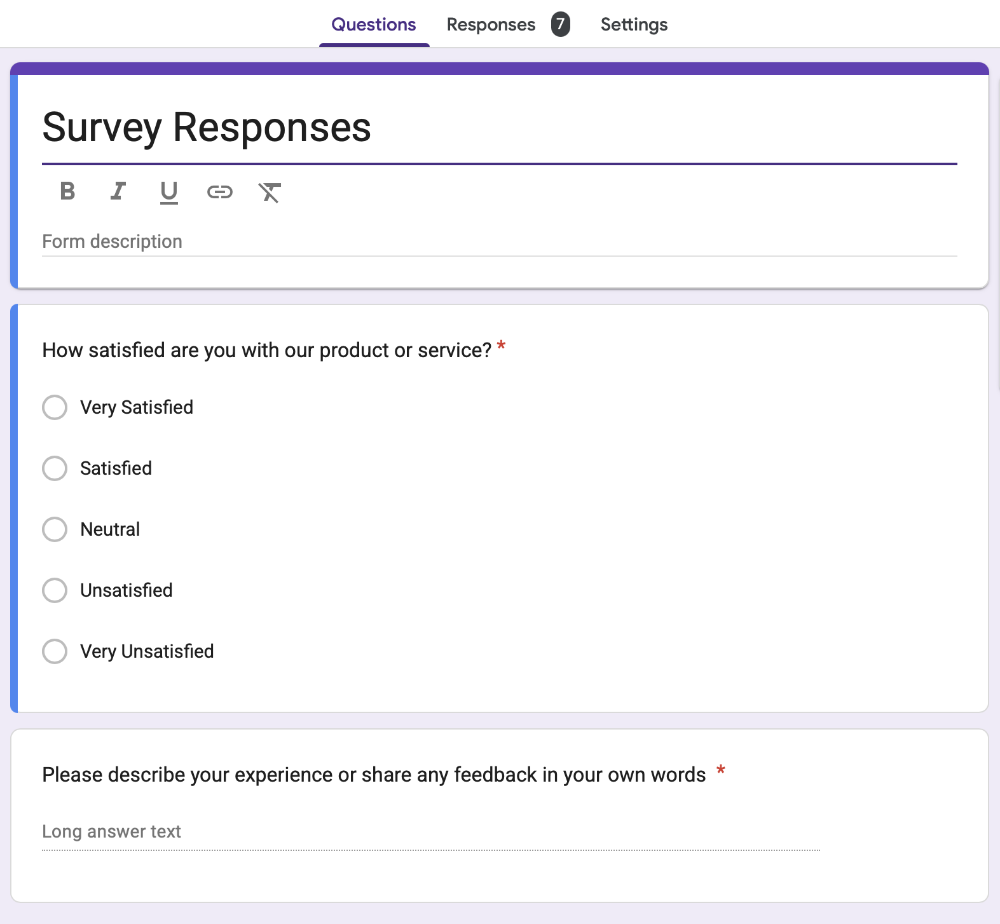

---

### Gemini AI Analysis Module

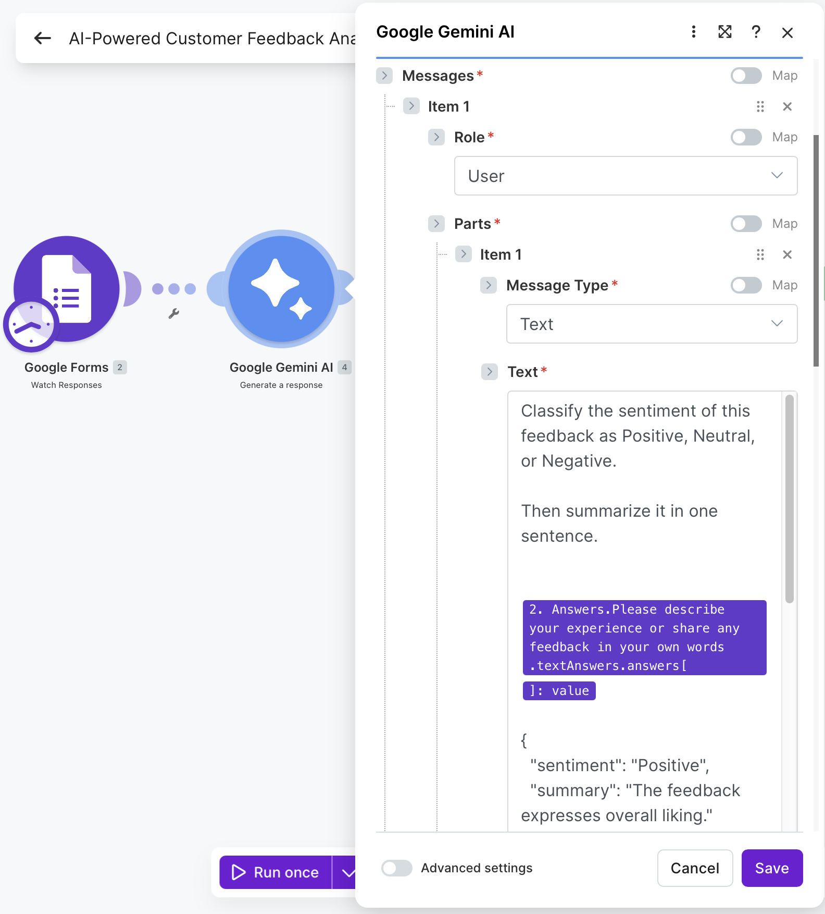

---

### Gemini Structured JSON Response

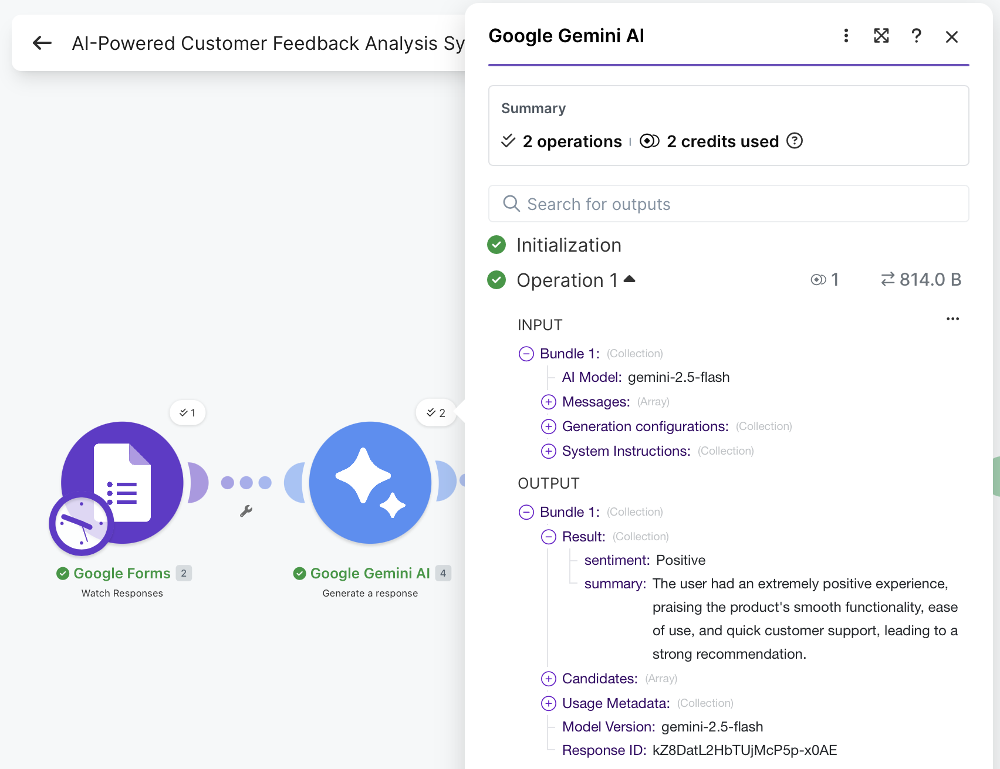

---

### JSON Parsing Module

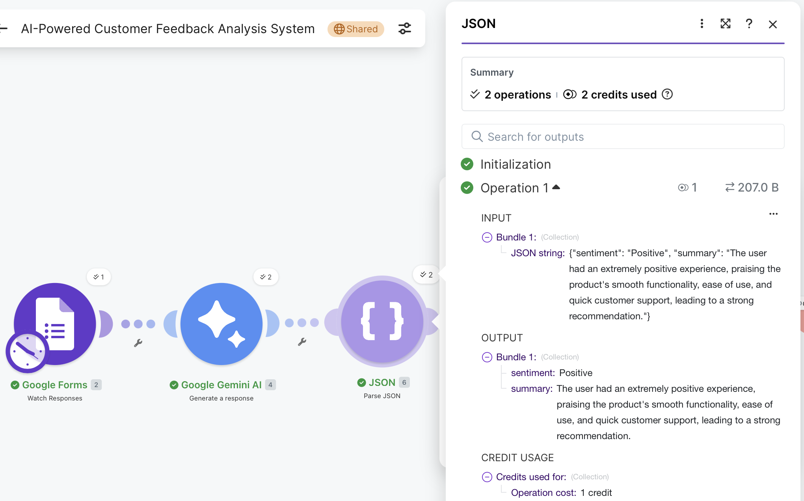

---

### Feedback Record Lookup Module

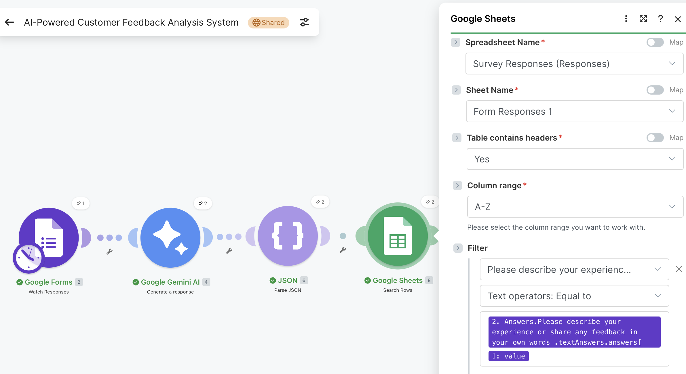

---

### Feedback Update Module

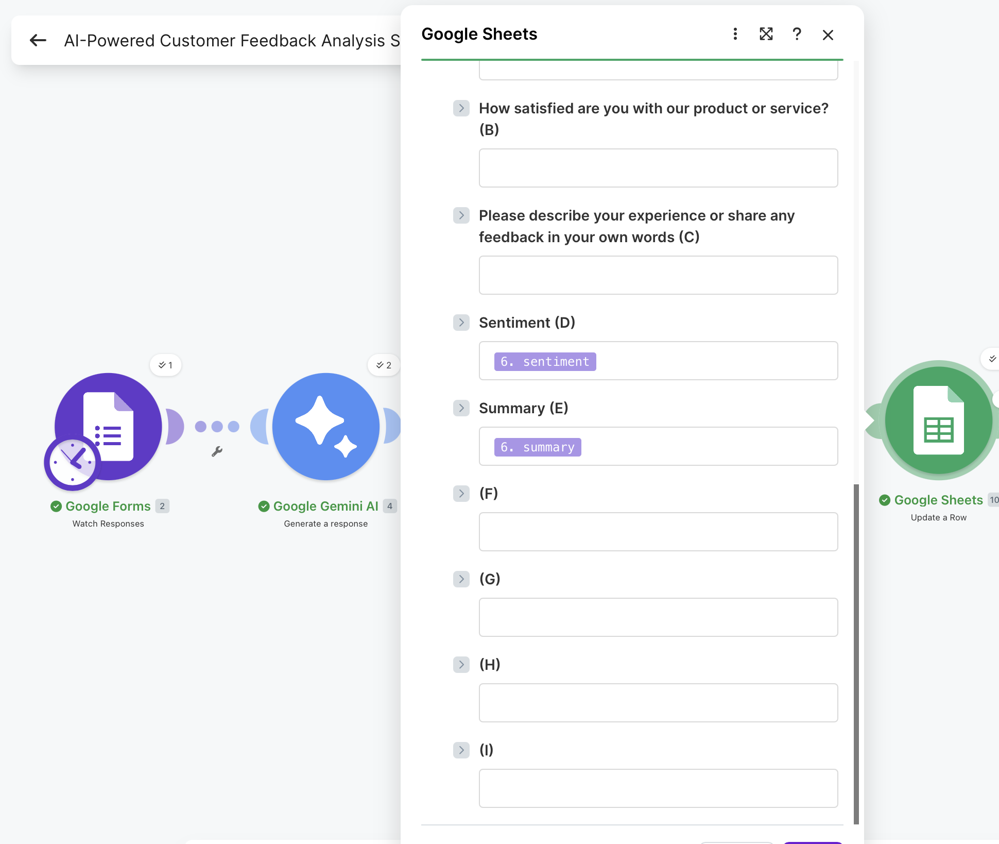

---

### Feedback Analysis Results Sheet

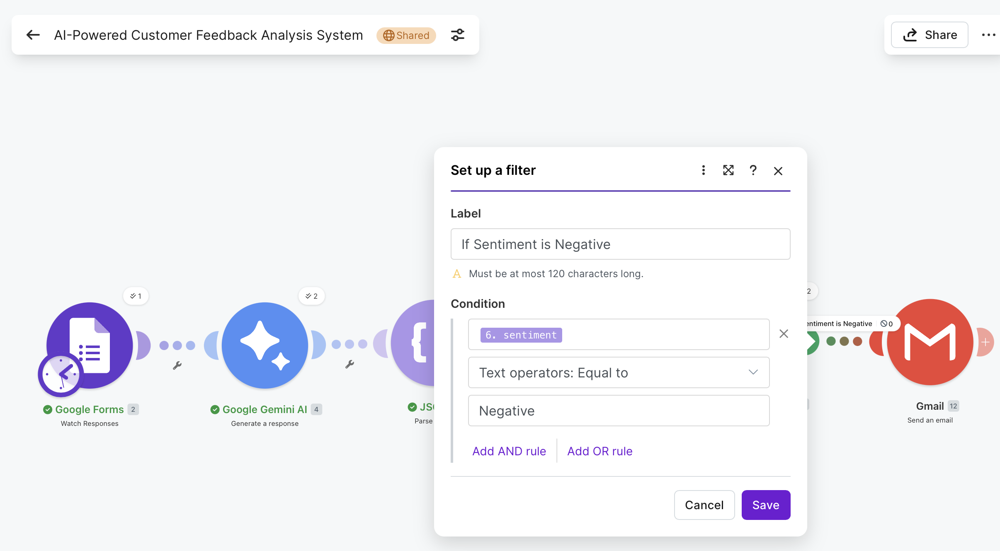

---

### Negative Sentiment Alert Module

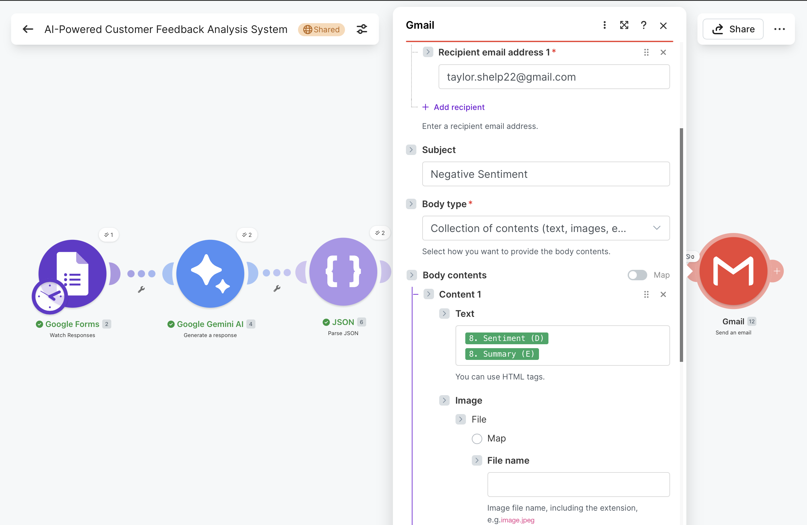

---

### Manager Alert Email Output

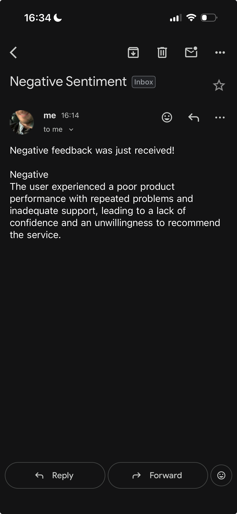

---

## Future Improvements

Potential future enhancements include:

- Slack or Microsoft Teams alert integrations
- AI-powered customer response recommendations
- Customer satisfaction trend dashboards
- CRM integration
- Multi-language sentiment analysis
- Escalation priority scoring

---

## Project Status

Completed as a functional AI-powered automation workflow for customer feedback analysis, sentiment detection, structured insight generation, and automated negative feedback alerting.
